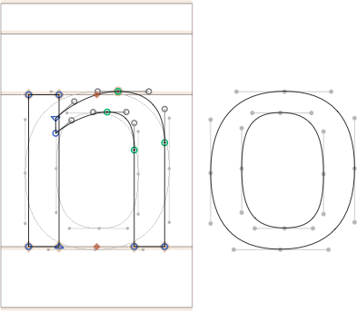

⚠️ Note: This plug-in is deprecated for Glyphs 3. Better use the built-in View > Show Nodes > In Background.

# ShowHandlesEverywhere.glyphsReporter

This is a plugin for the [Glyphs font editor](http://glyphsapp.com/) by Georg Seifert. It displays **nodes & handles** for paths **in the background** (if *View > Show Background* is on), **on other layers** (if the layer is set to visible) as well as **in inactive glyphs** surrounding the current glyph (if *View > Fill Preview* is off).

After installation, it will add the menu item *View > Show Handles Everywhere*.
You can set a keyboard shortcut in System Preferences.

### Installation

1. Download the complete ZIP file and unpack it, or clone the repository.
2. Double click the .glyphsReporter file. Confirm the dialog that appears in Glyphs.
3. Restart Glyphs

### Usage Instructions

1. Open a glyph in Edit View.
2. Use *View > Show Handles Everywhere* to toggle the display of coordinates for selected nodes.
3. Turn on *View > Show Background* (Cmd-Shift-B) if you want to see handles in the background paths.
4. Turn off *View > Fill Preview* to show handles in the surrounding glyphs in Edit view.
5. Turn on visibility of other layers you want to view with the eye symbols in the *Layers* palette (Cmd-Opt-P).

### Known Problems

If you use it with a lot of text, the plugin can slow down the app significantly. So, I advise to only use it with small bits of text, perhaps one or two words.

### Requirements

The plugin needs Glyphs 1.4.3 or higher, running on OS X 10.7 or later. I can only test it in current OS versions, and I assume it will not work in versions of Mac OS X older than 10.7.

### License

Copyright 2014 Rainer Erich Scheichelbauer (@mekkablue).
Based on sample code by Georg Seifert (@schriftgestalt).

Licensed under the Apache License, Version 2.0 (the "License");
you may not use this file except in compliance with the License.
You may obtain a copy of the License at

http://www.apache.org/licenses/LICENSE-2.0

See the License file included in this repository for further details.
